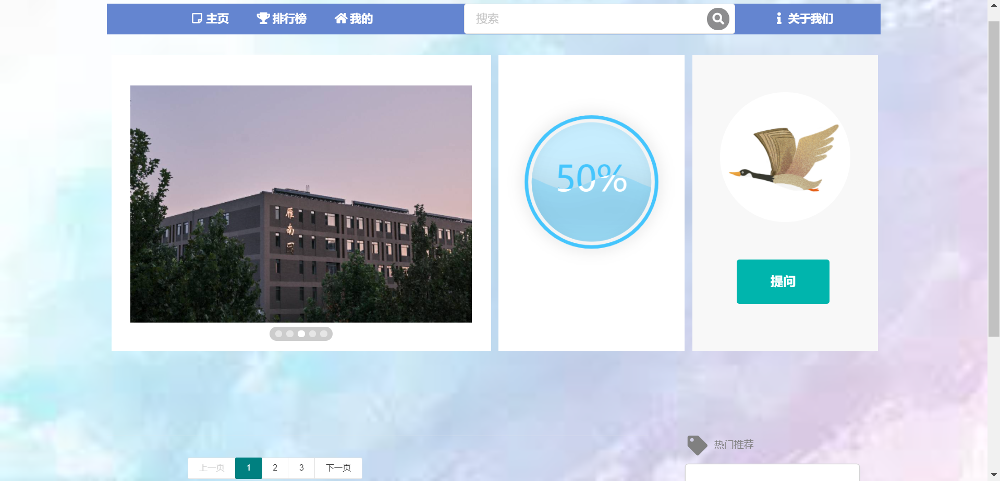
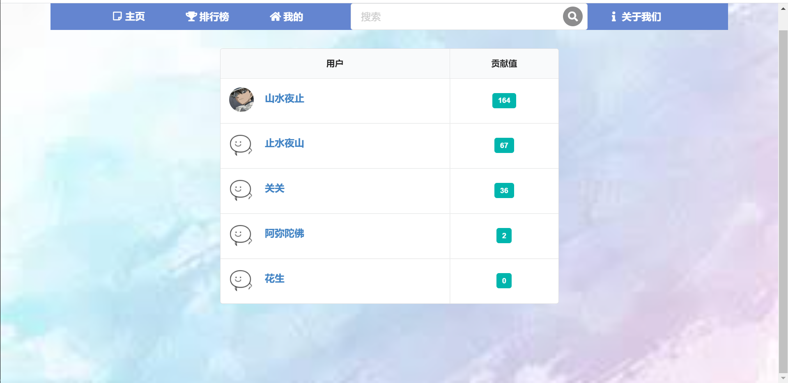
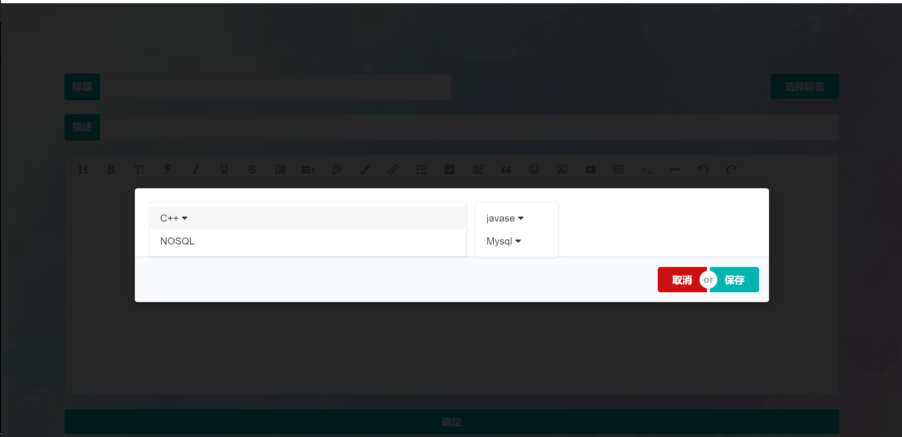
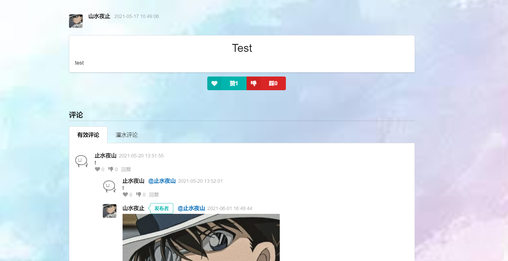

# WeSwallows

2020冬季雏燕项目——基于springboot的校内信息交互系统

## 项目设计

### 理念

网站旨在为学生们提供一个交流的平台，突破学生之间的信息和知识壁垒。

### 眼下与展望

我们将把服务分为以下几个板块：

#### StudyBy

在学习交流板块，我们已经对用户存在的需求基本满足。包括发布问题、评论、点赞、点踩、贡献值排行榜等等。未来会根据用户需求进一步扩展。

#### ShareWith

在信息分享板块，未来我们希望完成的是————

百科功能，人人可以编辑，但需要管理员审核，类似于百度百科，比如某某竞赛的具体信息。

问卷广场功能，自己设计或使用现有问卷系统的API，开辟“问卷广场”。设置奖励机制，一定程度上解决很多人不愿意填问卷，问卷的数据不足的情况。

个人博客功能——不止发布问题，还可以分享知识。

#### TeamUp

在组队区板块，未来我们希望完成的是————

队友匹配功能，基于用户个人标签、站内贡献值等等特征匹配出推荐组队人选，并通过站内私信互相进一步沟通了解。

#### 拓展

基于以上功能，我们还会提供以下服务，满足用户的潜在需求————

个性推荐功能，利用复杂网络链路预测，如协同过滤推荐算法，网络三角型结构推荐算法，来推荐可能用户感兴趣的、和与某个问题、博客、问卷、百科词条等等相关的内容。

引进社交功能，提供基于该网站，不依托于QQ微信的私信功能，方便互相进一步探讨问题。以及关注功能等等。

### 总体设计

- **本项目用到的技术和框架** 

|  工具 | 名称
| ------------ | ------------
| 开发工具  | IDEA、vscode
| 项目构建 | Maven
| UI框架 | layui、semantic UI
|  语言 | JDK1.8、HTML、css、js
| 富文本编辑器 | wangEditor.md
| 数据库  | Mysql5.6
| 项目框架  | springboot2.x
| ORM  | JPA
| 安全框架  | JWT
| 运行环境  | 腾讯云Centos7

### 部分页面展示

